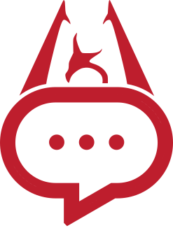

# DialogueTransformer

Patch Skyrim player dialogue through the power of AI!

## About
DialogueTransformer is a tool to use text generated by large language models (LLMs) as player dialogue in Skyrim. It's powered by [Synthesis](https://github.com/Mutagen-Modding/Synthesis), a patcher framework to generate mod plug-ins for various Bethesda games. Models are installed separately and come in the form of directories which are recognized by the patcher, these must contain the LLM itself but can also include pre-generated cache to speed up the patcher.
